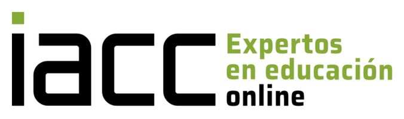

# Programación Web II

Este repositorio contiene las actividades realizadas en la materia **Programación Web II** del Instituto Profesional IACC. Cada semana subo los archivos correspondientes a las actividades del curso, las cuales están organizadas en carpetas separadas. Cada carpeta representa el trabajo de una semana específica, y dentro de ellas se incluyen los archivos desarrollados durante esa semana.

## Imagen del Instituto



**Instituto Profesional IACC**: [https://www.iacc.cl/](https://www.iacc.cl/)

## Instrucciones para Usar los Archivos

1. Clona el repositorio en tu máquina local:
    ```bash
    git clone https://github.com/fblazquezweber/Programacion-Web-II.git
    ```

2. Navega a la carpeta correspondiente a la semana que desees revisar.

3. Abre los archivos en tu editor de código favorito.

## Contribuciones

Si deseas contribuir o sugerir mejoras, puedes hacer un **fork** del repositorio y crear un **pull request**.

## Contacto

Si tienes preguntas o comentarios, puedes contactarme a través de:

- **Email**: fblazquezweber@gmail.com
